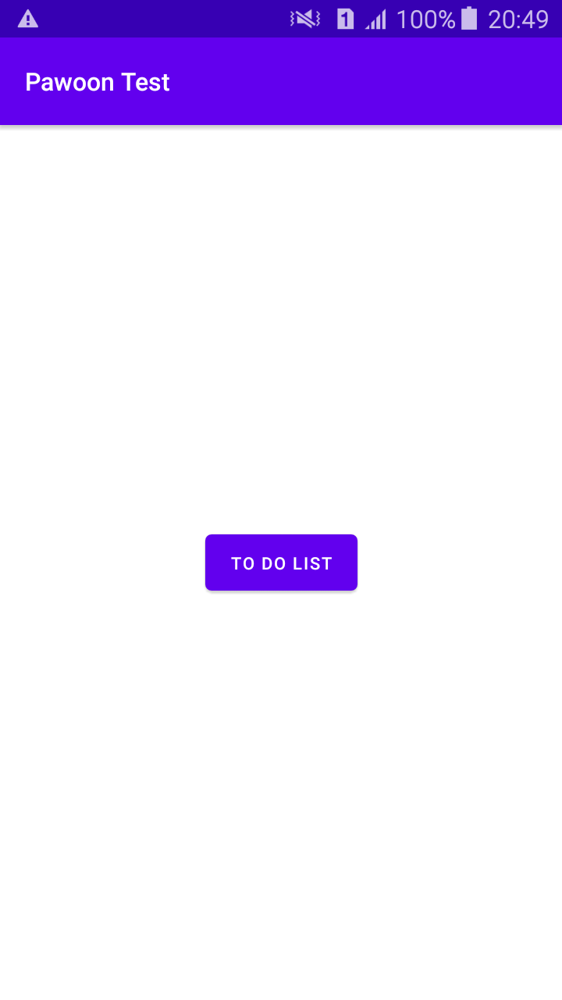
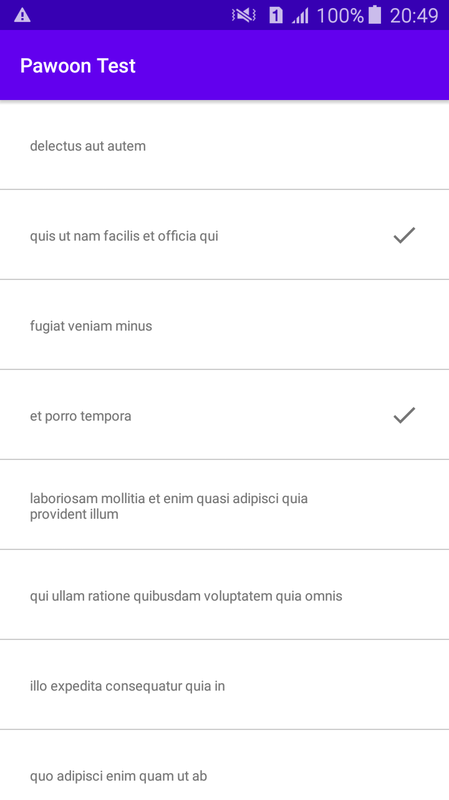

# PawoonTest
project testing dari pawoon

## Create Todo List App dan Basic pemrograman.
Must have:
- [x] Single Activity Architecture (use navigation component)
- [x] Main page and todo list page
- [x] Navigation todo list after click button in main page
- [x] Unit testing, basic pemrograman
- [x] Appropriate use of Loading/Error state between process / page transitions
- [x] Implementation of Room Database to cache previously loaded todolist data
- [x] Completed todos should have a check mark

Nice to have:
- [x] MVP Pattern
- [x] Use Material Design

## Preview Testing - Basic Pemrograman
check video in folder asset for the best preview

  

## Preview Behaviour - Android Pemrograman
check video in folder asset for the best preview

  

## Screenshot

  
  

## Libraries

#### Core & Jetpack

- [x] [Retrofit](https://square.github.io/retrofit/)
- [x] [RxAndroid]
- [x] [View Binding](https://developer.android.com/topic/libraries/view-binding)
- [x] [Jetpack Navigation](https://developer.android.com/guide/navigation/navigation-getting-started)
- [x] [Chuck](https://github.com/jgilfelt/chuck)
- [x] [Room](https://developer.android.com/jetpack/androidx/releases/room)

#### Development, Debug & Test

- [x] [jUnit]

## API

Using TodoList API . 
- [x] [REST API](https://jsonplaceholder.typicode.com/todos)

## Add Other Function
- [x] Chuck (Mostly for show data calling API)
- [x] Build Variant (Build apk any Server)

